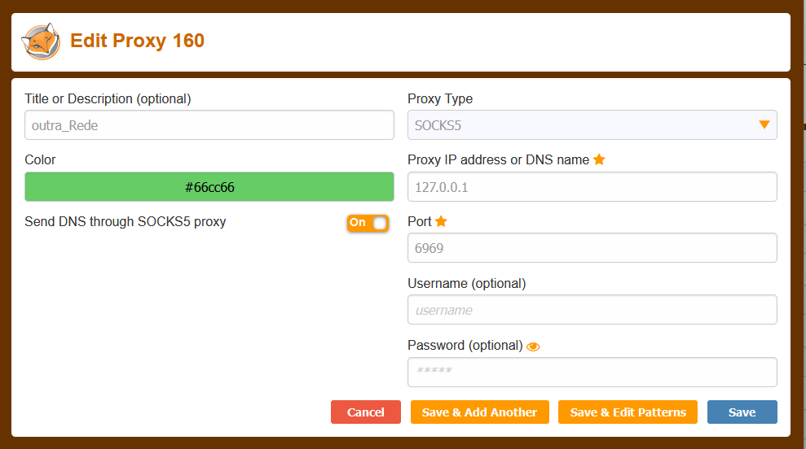

# Objetivo:
## Abrir um tunnel SSH para uma maquina que contenha 2 interfaces. 
## Usar uma solução como a extenção FoxyProxy no navegador configurar aponntando a porta contida no script. 
## Assim da para navegar de uma outra rede atravez de um tunel SSH, Muito util para fazer troubleshoots.

